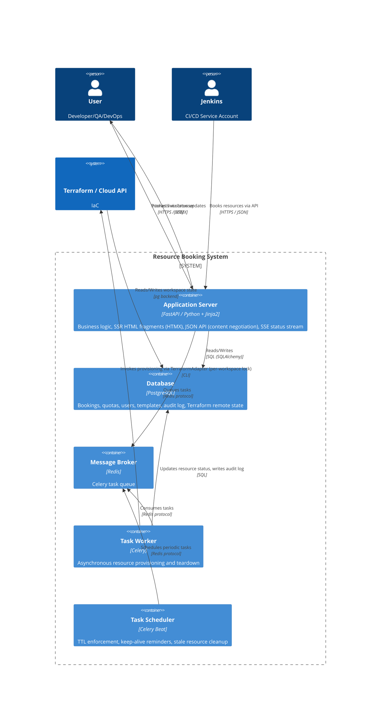

# Architectural Design: Computational Resources Booking System

## 1. Technology Stack

| Component | Technology | Justification |
| :--- | :--- | :--- |
| **Backend Language** | Python 3.11+ (Type Hinting) | Fast development, rich library ecosystem, strict typing for reliable business logic. |
| **Web Framework** | FastAPI | High performance (asyncio), automatic OpenAPI generation, ideal compatibility with HTMX for HTML fragment delivery. Content negotiation supports both browser (HTML) and API (JSON) clients from the same routes. |
| **Frontend** | HTMX + Tailwind CSS | Avoiding SPA complexity (React) in favor of server-side rendering (SSR). Simplified frontend state, faster feature delivery, reduced client-side JS. Native SSE support for real-time status updates. |
| **Database** | PostgreSQL | Reliable relational data storage, complex query support for quota and resource management. `SELECT FOR UPDATE` used for quota enforcement. Serves as Terraform remote state backend. |
| **Task Queue** | Celery + Redis | Simplified deployment in closed environments, lower resource requirements, sufficient reliability for current MVP tasks. |
| **Task Scheduler** | Celery Beat | Periodic task execution for TTL enforcement, keep-alive reminder dispatch, and automated resource cleanup. |
| **Infrastructure** | Terraform | Industry IaC standard for declarative cloud and on-premise resource management. Per-resource workspace isolation prevents state conflicts between concurrent provisioning tasks. |

---

## 2. Container Diagram (C4 Level 2)



---

## 3. Interaction Description

### 3.1 Request → Response Cycle (Hypermedia Driven)
Unlike a classic SPA where the client requests JSON and renders UI itself, this architecture uses the **HATEOAS** approach via HTMX:

1. **Action:** User clicks the "Book Resource" button.
2. **Request:** HTMX sends an AJAX request (e.g., `POST /bookings/create`) to the server.
3. **Processing:** FastAPI runs `CreateBookingUseCase` — acquires a quota lock, creates a DB record (status `PENDING`), queues a Celery task, and releases the lock.
4. **Response:** The server returns a **ready HTML fragment** (e.g., a booking row with a live status indicator) — not JSON.
5. **Update:** HTMX injects the received fragment into the DOM without a full page reload.

All state rendering logic resides on the server, keeping the client thin.

### 3.2 Live Status Updates (SSE)
Once a booking row is rendered, its status indicator subscribes to a server-sent event stream:

```
GET /bookings/{id}/status-stream   (text/event-stream)
```

The Celery worker writes status transitions to PostgreSQL. The SSE endpoint polls the DB and pushes `data:` events to the browser. HTMX's `hx-ext="sse"` swaps the status fragment on each event. The connection closes when the resource reaches a terminal state (`READY` or `FAILED`).

SSE is preferred over polling (reduces unnecessary DB load) and WebSockets (one-directional push requires no bidirectional channel).

### 3.3 Jenkins API (Content Negotiation)
The same FastAPI routes serve both browsers and the Jenkins service account. The route inspects the `Accept` header:

- `Accept: text/html` → returns an HTML fragment (browser / HTMX path)
- `Accept: application/json` → returns JSON (Jenkins / API path)

This keeps the routing layer unified. The `CreateBookingUseCase` is shared; only the serializer differs. Jenkins receives credentials in the JSON response body; no separate credential delivery mechanism is needed.

---

## 4. Celery Integration and State Management

### 4.1 Request Flow
`FastAPI` → `Redis` → `Celery Worker` → `TerraformAdapter` → `VMware`

> **Pooled resources are the exception (v0.5.0–0.6.0).** Static VMs (`STATIC_VM`) and
> Kubernetes namespaces (`NAMESPACE`) are *reserved from an admin-managed pool*, not
> provisioned. The reserve use case takes either a specific resource or the next free one
> (`SELECT … FOR UPDATE SKIP LOCKED`, so concurrent reservations never collide) synchronously,
> and the booking goes straight to `READY` — **no Celery task, no Terraform**. Static VMs hand
> the owner stored host + credentials; namespaces issue none. Release / TTL expiry returns the
> resource to the pool. The Terraform request flow above applies to provisioned VMs only;
> pooled resources never touch Redis / the worker / `TerraformAdapter`.
>
> **Booking queue.** When a pooled type's pool is empty, an "Any available" request is created
> as **`QUEUED`** instead of failing. A shared `promote_next_queued(resource_type)` runs
> wherever a pooled resource frees (the release route and the TTL teardown task): it locks the
> oldest `QUEUED` booking of that type and a free resource (both `FOR UPDATE SKIP LOCKED`),
> assigns it, and flips it to `READY` with its TTL starting then. The 3 s row poll surfaces the
> promotion live.

### 4.2 State Management
State management and progress tracking are handled entirely at the **PostgreSQL** level.

- **DB Statuses:** `PENDING` → `PROVISIONING` → `READY` / `FAILED` (provisioned); pooled
  bookings start at `READY`, or at **`QUEUED`** when the pool is empty (auto-promoted to
  `READY` on the next free resource). Release moves any booking to `RELEASED`.
- **Updates:** The Celery worker writes a DB status transition at each stage of task execution.
- **Audit:** Every status transition is appended to the `booking_audit` table (see Section 6).

### 4.3 Terraform Workspace Isolation and Idempotency
Each booking maps to a dedicated Terraform workspace (`workspace_id = booking_id`). This prevents concurrent provisioning tasks from corrupting shared state.

Before the `TerraformAdapter` calls `terraform apply`, it acquires a DB advisory lock on the workspace ID:

```sql
SELECT pg_try_advisory_xact_lock(booking_id);
```

If the lock is unavailable, the Celery task is retried with backoff. The Terraform state backend is configured to use PostgreSQL (`pg` backend), eliminating reliance on local disk state in containerized workers.

Idempotency is enforced by the adapter: before `apply`, it checks the current workspace state. If the resource already exists in state (e.g., after a worker crash mid-apply), the adapter skips re-provisioning and advances the DB status directly.

### 4.4 Scheduled Tasks (Celery Beat)
Celery Beat handles time-driven lifecycle events:

| Task | Schedule | Action |
| :--- | :--- | :--- |
| `enforce_ttl` | Every `ENFORCE_TTL_INTERVAL_SECONDS` (default 60s) | Finds expired bookings, queues teardown; pooled releases then auto-promote the next queued booking |
| `send_keepalive_reminders` | Daily | Notifies owners of permanent resources requiring confirmation |
| `reap_stale_provisioning` | Every 15 min | Marks bookings stuck in `PROVISIONING` for over 1h as `FAILED` |

---

## 5. Quota Enforcement

Quota checks must be atomic to prevent race conditions when multiple users book concurrently against the same team or project limit.

The `CreateBookingUseCase` enforces this with a pessimistic lock:

```python
# Inside a DB transaction
quota = session.execute(
    select(Quota)
    .where(Quota.team_id == team_id)
    .with_for_update()
).scalar_one()

if quota.used + requested > quota.limit:
    raise QuotaExceededError()

quota.used += requested
session.add(Booking(...))
# commit releases the lock
```

The lock is held only for the duration of the insert — contention is minimal. No distributed locking infrastructure is required.

---

## 6. Audit Log

Every mutation to a booking or resource appends a record to `booking_audit`:

| Column | Type | Description |
| :--- | :--- | :--- |
| `id` | UUID | |
| `booking_id` | UUID FK | |
| `actor_id` | UUID FK | User or service account |
| `action` | enum | `CREATED`, `STATUS_CHANGED`, `EXTENDED`, `DELETED`, `SHARED` |
| `old_value` | JSONB | Previous state snapshot |
| `new_value` | JSONB | New state snapshot |
| `created_at` | timestamptz | |

Writes happen in the Application Layer (Use Cases), ensuring audit entries are always co-committed with the change they record. The audit table is append-only — no updates or deletes.

---

## 7. Architectural Principles (DDD/Clean Architecture)

The code is divided into four layers with strict dependency direction (outer layers depend on inner, never the reverse):

- **Domain Layer:** Entities (`Booking`, `Resource`, `Quota`, `Environment`), Value Objects, domain services. Pure Python, no framework dependencies.
  > *Status (v0.6.0):* `Booking`, `Quota`, and `Namespace` + `StaticVM` catalog entities exist
  > today. A `Booking` distinguishes resource kinds via a `resource_type` discriminator (`VM` |
  > `STATIC_VM` | `NAMESPACE`) rather than a polymorphic `Resource`; pooled types
  > (`STATIC_VM`, `NAMESPACE`) share the reserve + queue machinery. The dedicated `Resource` /
  > `Environment` entities remain planned (see `docs/0.5.0/plan.md` → "Future Direction:
  > Environments").
- **Application Layer:** Use Cases (e.g., `CreateBookingUseCase`, `ExtendBookingUseCase`). Coordinates DB repositories, quota enforcement, Celery task dispatch, and audit writes.
- **Infrastructure Layer:** Repository implementations (SQLAlchemy / PostgreSQL), Celery task definitions, `TerraformAdapter` (CLI wrapper with workspace and lock management).
- **Presentation Layer:** FastAPI routes — content-negotiated responses returning either Jinja2 HTML templates or Pydantic JSON schemas.
