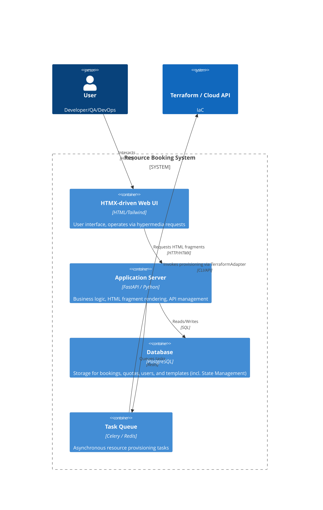

# Architectural Design: Computational Resources Booking System

## 1. Technology Stack

| Component | Technology | Justification |
| :--- | :--- | :--- |
| **Backend Language** | Python 3.11+ (Type Hinting) | Fast development, rich library ecosystem, strict typing for reliable business logic. |
| **Web Framework** | FastAPI | High performance (asyncio), automatic OpenAPI generation, ideal compatibility with HTMX for HTML fragment delivery. |
| **Frontend** | HTMX + Tailwind CSS | Avoiding SPA complexity (React) in favor of server-side rendering (SSR). Simplified frontend state, faster feature delivery, reduced client-side JS. |
| **Database** | PostgreSQL | Reliable relational data storage, complex query support for quota and resource management. |
| **Task Queue** | Celery + Redis | Simplified deployment in closed environments, lower resource requirements, sufficient reliability for current MVP tasks. |
| **Infrastructure** | Terraform | Industry IaC standard for declarative cloud and on-premise resource management. |

---

## 2. Container Diagram (C4 Level 2)

---

## 3. Interaction Description

### Request → Response Cycle (Hypermedia Driven)
Unlike a classic SPA where the client requests JSON and renders UI itself, this architecture uses the **HATEOAS** approach via HTMX:

1. **Action:** User clicks the "Book Resource" button.
2. **Request:** HTMX sends an AJAX request (e.g., `POST /bookings/create`) to the server.
3. **Processing:** FastAPI handles the request, creates a DB record (status `PENDING`), and queues a Celery task.
4. **Response:** The server returns not JSON but a **ready HTML fragment** (e.g., a notification row "Request accepted, resource creation started..." or an updated resource table).
5. **Update:** HTMX injects the received fragment into the DOM at the specified location without a full page reload.

This significantly simplifies development since all state rendering logic resides on the server.

---

## 4. Celery Integration and State Management

For asynchronous provisioning, the **Task Queue** pattern is used.

### Request Flow
`FastAPI` → `Celery Task` → `TerraformAdapter` → `VMWare`

### State Management
Since Celery is stateless compared to Temporal, state management and progress tracking are fully handled at the **PostgreSQL** database level.
- **DB Statuses:** The bookings/resources table maintains statuses (e.g., `PENDING` → `PROVISIONING` → `READY` / `FAILED`).
- **Updates:** The Celery worker updates the corresponding DB record when transitioning between task execution stages.
- **Notifications:** The UI polls via HTMX polling or websockets to fetch the current status from the DB for display to the user.

Integration uses a standard Redis broker. Celery workers execute heavy Terraform CLI calls through a specialized adapter.

## 5. Architectural Principles (DDD/Clean Architecture)

For scalability, the code is divided into layers:
- **Domain Layer:** Entities (`Booking`, `Resource`, `Quota`), Value Objects, and domain services. Pure Python, no framework dependencies.
- **Application Layer:** Use Cases (e.g., `CreateBookingUseCase`). Coordinates between the DB and the Celery task queue.
- **Infrastructure Layer:** Repository implementations (SQLAlchemy/PostgreSQL), Temporal SDK integration, and Terraform CLI.
- **Presentation Layer:** FastAPI routes returning HTML templates (Jinja2).
